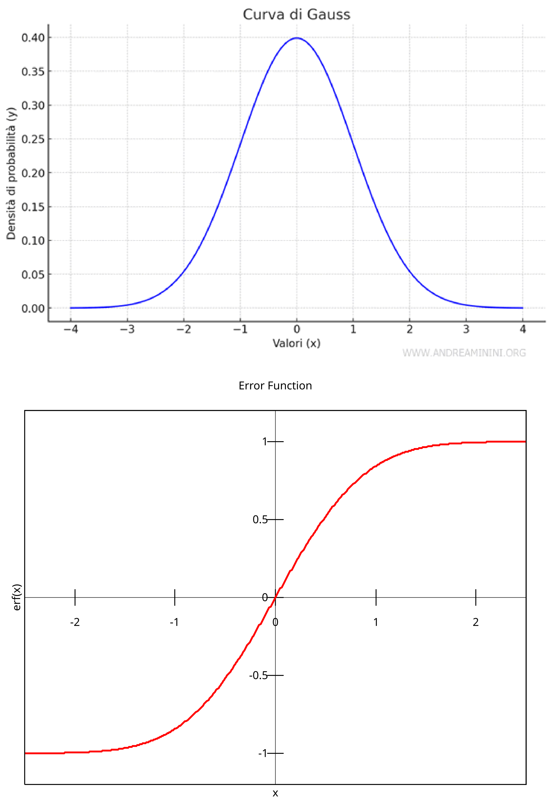
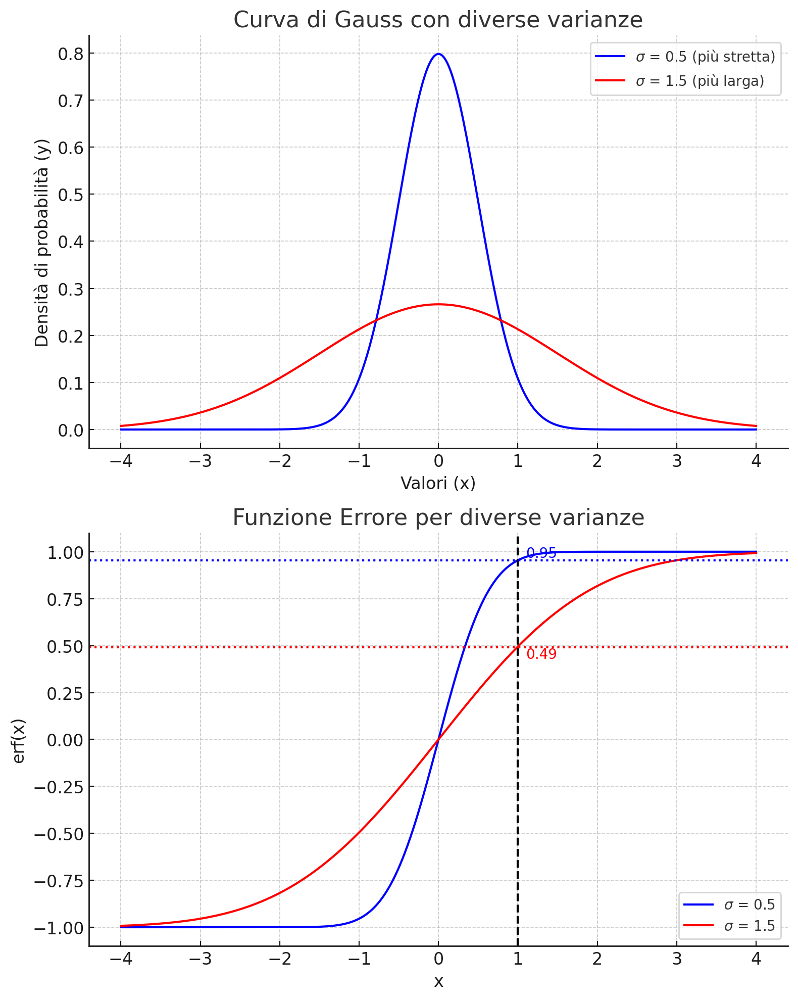

# Distribuzione normale
La distribuzione normale (o distribuzione di Gauss), è una distribuzione di probabilità continua che è spesso usata per descrivere variabili casuali a valori reali che tendono a concentrarsi attorno a un singolo valor medio.

La distribuzione normale è caratterizzata dalla seguente funzione di densità di probabilità (**PDF**), cui spesso si fa riferimento con la dizione curva di Gauss o gaussiana:

$$
f(x) = \frac{1}{\sigma \sqrt{2\pi}} e^{-\frac{(x - \mu)^2}{2\sigma^2}}
$$

dove:
- $ x $ è la variabile casuale continua,
- $ \mu $ è la media della distribuzione (il valore centrale),
- $ \sigma $ è la deviazione standard (che determina la larghezza della curva),
- $ \sigma^2 $ è la varianza,

Valori di $x$ con $f(x)$ più alti sono più frequenti nella distribuzione. Per esempio, se $f(x)$ è massimo in $x = \mu$, significa che la media è il valore più probabile.

## Funzione di distibuzione cumulativa (**CDF**)
In probabilità e statistica, la funzione di distribuzione cumulativa (CDF) di una variabile casuale $X$ indica la probabilità che $X$ assuma un valore minore o uguale a un certo valore x. 
In altre parole, ci dice con quale probabilità la variabile $X$ non superi un determinato valore.

Se sottrai due funzioni di distribuzione cumulativa di una distribuzione gaussiana, ottieni la probabilità che la variabile casuale sia compresa tra due valori.

### Definizione matematica
Per una variabile casuale $X$ che segue una distribuzione normale con media $\mu$ e deviazione standard $\sigma$, la funzione di distribuzione cumulativa è definita come:
$$ F(x) = P(X \leq x) = \int_{-\infty}^{x} f(t) \,dt $$
Dove $f(t)$ è la funzione di densità di probabilità (PDF)

La sottrazione tra due CDF è espressa come:
$$ P(a \leq X \leq b) = F(b) - F(a) $$

## Funzione di errore Gaussiana

La **funzione di errore gaussiana**, nota come **funzione di errore** e indicata con $\ text{erf}(x)$, è definita come:

$$\text{erf}(x) = \frac{2}{\sqrt{\pi}} \int_0^x e^{-t^2} dt $$

### Proprietà principali
- **È una funzione sigmoide**: parte da -1 per $x \to -\infty$ e tende a +1 per $x \to +\infty$.
- **Non ha una forma chiusa**: l'integrale non può essere espresso con funzioni elementari.
- **Si usa in statistica**: è strettamente legata alla distribuzione normale, poiché **permette di calcolare probabilità cumulative**.

### Relazione con la CDF
La funzione di errore è strettamente collegata alla CDF della distribuzione normale standardizzata. La CDF di una variabile casuale normale standard **con media 0 e deviazione standard 1** è data da:

$$
\Phi(x) = \frac{1}{2} \left[ 1 + \operatorname{erf} \left( \frac{x}{\sqrt{2}} \right) \right]
$$

Dove $\Phi(x) $ rappresenta la probabilità che una variabile casuale normale standard sia minore o uguale a $ x $.

## erf() VS CDF
**erf() viene spesso preferita alla CDF per i calcolo delle probabilità**. Le ragioni sono le seguenti:
- L'uso di $erf(x)$ è generalmente più veloce rispetto al calcolo diretto di $\Phi(x)$, perché l'integrale della funzione esponenziale nella definizione di $\Phi(x)$ è più difficile da approssimare direttamente rispetto alla forma standardizzata di $erf(x)$.
- $erf()$ è già implementata in molte librerie numeriche ottimizzate (come la libreria standard di C++, MATLAB, Python SciPy, ecc.)
- Il calcolo diretto dell'integrale della CDF può essere numericamente instabile, specialmente per valori di x molto grandi o piccoli. La funzione di errore è stata studiata e ottimizzata in molte librerie numeriche per garantire stabilità e accuratezza anche per valori estremi.

# Distribuzione della radiazione
La radiazione inviata alle cellule segue una distribuzione gaussiana, con le cellule più vicine al centro di irradiazione che ricevono una dose maggiore rispetto a quelle più distanti, secondo un andamento a forma di campana.
E' quindi necessario regolare la quantita di dose inviata in funzione del centro di irradiazione.
## Funzione `erf()`
La **funzione degli errori di Gauss** è strettamente legata alla distribuzione normale e alla sua funzione di distribuzione cumulativa (CDF). Il suo utilizzo implica implicitamente l'assunzione di una distribuzione normale. Ha la seguente forma:

    

Per irradiare la cellula si utilizza la funzione `radiate()`, alla quale dobbiamo passare un valore di dose come parametro. Come già detto, questo valore deve considerare la forma della distribuzione gaussiana.

Se ci trvassimo nel punto +1 (sull'asse x), vicino al centro di irradiazione, dovremmo passare a `radiate()` un valore di dose più alto rispetto a quando ci troviamo nel punto +2 cioè più distante dal centro di irradiazione.

`erf()` si occupa proprio di gestire questo comportamento attraverso la funzione `conv()`.

**Attenzione**: la funzione `conv()` non restituisce un valore di dose, ma un indice che indica quanto la dose deve essere elevata in quel punto.

## `Conv()`
`Conv()` è definita come `erf((rad - x)/denom) - erf((-rad - x) / denom)` dove
- `rad`: Raggio della radiazione in cui si ha il 95% della dose totale
- `x`: Distanza dal centro di irraggiamento.

Analizziamo come questa funzione replichi il comportamento di una distribuzione gaussiana per la radiazione, ossia producendo valori bassi lontano dal centro di irradiazione e valori elevati in prossimità del centro:

**Per semplicità, consideriamo denom = 1**. Analizziamo ora due casi limite.
$$
\text{erf}(\text{rad} - x) - \text{erf}(\text{-rad} - x)
$$
dove $\text{rad}$ il raggio di irradiazione e $x$ distanza dal centro di irradiazione.

- Per $x$ piccoli: 
    $$\text{erf}(\text{rad} - x) - \text{erf}(\text{-rad} - x) = $$
    $$\text{erf}(\text{rad}) - \text{erf}(\text{-rad}) = 1 - (-1) = 2$$

    - $\text{erf}(\text{rad}) = 1$ poichè ci troviamo a destra nel grafico di $\text{erf}$
    - $\text{erf}(\text{rad}) = 1$ poichè ci troviamo a destra nel grafico di $\text{erf}$

- Per $x$ grandi:
    $$\text{erf}(\text{rad} - x) - \text{erf}(\text{-rad} - x) = $$
    $$\text{erf}(\text{-x}) - \text{erf}(\text{-x}) = -1 - (-1) = 0$$

    - $\text{erf}(\text{-x}) = -1$ poichè ci troviamo a sinistra nel grafico di $\text{erf}$

Abbiamo quindi che per distanze dal centro piccole, `conv()` restituirà valori grandi e per distanze grandi, valori piccoli.

**Nota**:`conv()` ci fornisce un valore proporzionale alla dose in funzione della distanza dal centro dell'irradizione non è un valore di dose.

### `conv(14,0)`
La funzione `conv(14,0)` restituisce il valore massimo, poiché il parametro `0` indica il centro della distribuzione, ovvero il punto in cui la funzione assume il suo massimo valore.

### Normalizzazione distanza **`conv(14,x*10/radius)`**
Quando si vuole calcolare il valore di radiazione, a una certa distanza dal centro, si utilizza `conv(14,x*10/radius)`. 

## Ruolo del demoninatore in `erf()`
Consideramo $\text{erf }(\frac{14 - 0}{denom})$ e due valori per `denom`:
$$
\text{erf }(\frac{\text{rad} - x}{denom}) - \text{erf }(\frac{\text{-rad} - x}{denom}) 
$$
- `denom = 1`: 
    $$
    \text{erf}(14 - 0) - \text{erf}(-14 - 0) = 2
    $$
    - $\text{erf }(14)\approx 1$

- `denom = 2`: 
    $$
    \text{erf }(\frac{\text{14} - 0}{2}) - \text{erf }(\frac{\text{-14} - 0}{2}) \approx 1 
    $$
    - $\text{erf }(\frac{14}{2}) \approx 0,5$

Da cui notiamo che: 
$$
\text{denom} \nearrow \; \Rightarrow \; \text{erf()} \searrow
$$
$$
\text{denom} \searrow  \; \Rightarrow \; \text{erf()} \nearrow
$$

Nella suente immagine notiamo che, fissato un $x$, valori di `erf()` piccoli corrispondono ad una distribuzione meno piccata (deviazione standard più grande). Di conseguenza, l'effetto di `denom` è quello di "allargare" o "stringere" la distibuzione. 

    

 
## Moltiplicatore
La dose effettiva da passare come parametro alla funzione `radiate()` viene calcolata utilizzando il metodo `scale()`. Questo metodo moltiplica il risultato di `conv()` per un fattore di scala denominato `multiplicator`.

Il valore di `multiplicator` viene determinato tramite il metodo `get_multiplicator()`, che calcola il rapporto tra il valore massimo della dose e il valore di `conv()` al centro della distribuzione. In questo modo, moltiplicando `multiplicator` per il valore di `conv()` a una certa distanza dalla distribuzione, si ottiene il valore corretto da fornire come parametro a `radiate()`.

Ad esempio, supponiamo che il valore massimo della dose sia pari a 2. Se calcoliamo la dose al centro della distribuzione di irradiazione avremo:

$$
\text{multiplicator} \cdot \text{conv(centro)} = \frac{\text{dose}}{\text{conv(centro)}} \cdot \text{conv(centro)} = \text{dose}
$$

Questo conferma che al centro della distribuzione otteniamo effettivamente il valore massimo della dose, come previsto.

